# 离线数仓项目实战

## 1 项目介绍

本项目是一个基于电商业务的离线数仓建设方案，围绕电商业务指标统计需求构建。项目采用经典的四层数据分层架构（ODS -> DWD/DIM -> DWS -> ADS），实现了从数据采集、清洗转换到数据分析的完整流程。

## 2 技术架构

### 2.1 整体架构

本离线数仓项目的技术架构由四个关键部分组成：

| 模块         | 描述              | 核心组件              |
| :--------- | :-------------- | :---------------- |
| **数据源模块**  | 生成电商业务数据和用户日志数据 | Java、MySQL、Kafka  |
| **数据采集模块** | 从多种数据源采集数据到ODS层 | DataX、Flume、Kafka |
| **数仓模块**   | 实现数据分层处理和指标计算   | Hive、Spark        |
| **数据可视化**  | 展示业务指标和数据洞察     | Superset、DataRT   |

### 2.2 数据流向

```
┌─────────────────────────────────────────────────────────────────────────────┐
│                           数据源层                                         │
├───────────────────────┬─────────────────────────────────────────────────────┤
│   MySQL (业务数据)     │         本地磁盘 (日志数据)                        │
└───────────┬───────────┴───────────────────┬─────────────────────────────────┘
            │                               │
            ▼                               ▼
┌───────────────────────┐           ┌─────────────────────────────────────────┐
│      DataX           │           │              Flume                      │
│    (全量同步)         │           │           (日志采集)                   │
└───────────┬───────────┘           └───────────────┬─────────────────────────┘
            │                                       │
            │                                       ▼
            │                           ┌─────────────────────────────────────┐
            │                           │              Kafka                  │
            │                           └───────────────┬─────────────────────┘
            │                                           │
            │                                           ▼
            │                           ┌─────────────────────────────────────┐
            │                           │              Flume                  │
            │                           │           (消费写入)                │
            │                           └───────────────┬─────────────────────┘
            │                                           │
            └───────────────────────────────────────────┘
                                                   │
                                                   ▼
                              ┌─────────────────────────────────────────────┐
                              │            HDFS (ODS层)                     │
                              └─────────────────────┬───────────────────────┘
                                                    │
                                                    ▼
                              ┌────────────────────────────────────────────┐
                              │           数仓处理层                        │
                              ├────────────┬────────────┬──────────────────┤
                              │    DIM     │    DWD     │    DWS  │  ADS   │
                              │ (维度层)    │ (明细层)    │ (服务层) │(应用层) │
                              └────────────┴────────────┴──────────────────┘
                                                    │
                                                    ▼
                              ┌─────────────────────────────────────────────┐
                              │          数据可视化层                         │
                              ├─────────────────────────────────────────────┤
                              │              Superset                       │
                              └─────────────────────────────────────────────┘
```

## 3 软件版本

| 软件       | 版本     | 用途      |
| :------- | :----- | :------ |
| Hadoop   | 3.1.3  | 分布式存储框架 |
| Hive     | 3.1.3  | 数据仓库工具  |
| Spark    | 3.3.0  | 大数据处理引擎 |
| Kafka    | 3.6.1  | 消息队列    |
| Flume    | 1.11.0 | 日志采集    |
| DataX    | 2.0.3  | 数据同步工具  |
| MySQL    | 8.0    | 业务数据库   |
| Superset | 2.1.0  | 数据可视化   |

## 4 数据采集方案

### 4.1 业务数据采集

业务数据采用**全量+增量**的混合采集策略：

| 数据类型 | 采集方式    | 工具            | 目标存储          |
| :--- | :------ | :------------ | :------------ |
| 全量数据 | 定时全量同步  | DataX         | HDFS (ODS全量表) |
| 增量数据 | CDC实时采集 | Flume + Kafka | HDFS (ODS增量表) |

#### 4.1.1 部分业务数据展示

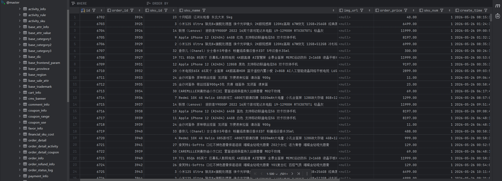

### 4.2 日志数据采集

用户行为日志通过Flume采集到Kafka，再由Flink或Spark Streaming消费写入ODS层：

```
用户日志 → Flume Agent → Kafka Topic → Flume Consumer → HDFS (ods_log_inc)
```

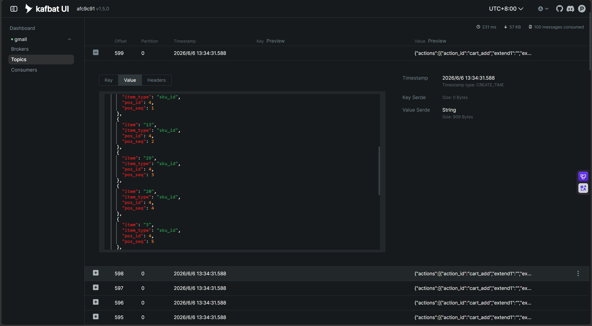

### 4.3 Kafka主题数据同步

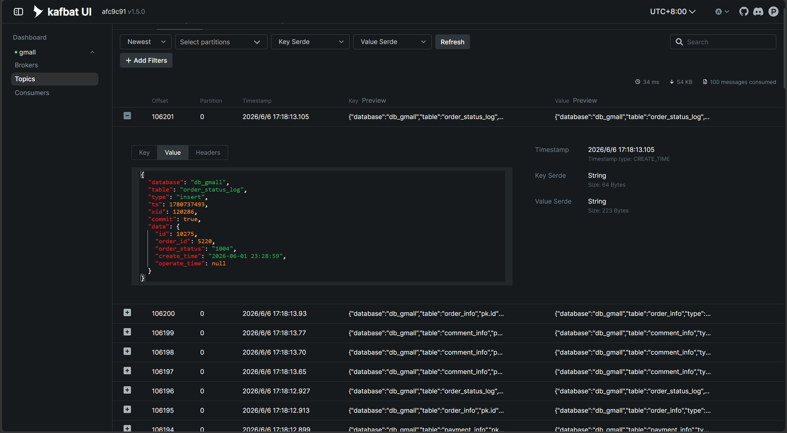

## 5 数仓分层设计

### 5.1 ODS层（操作数据存储）

ODS层直接存储原始业务数据和日志数据，保持数据原貌。

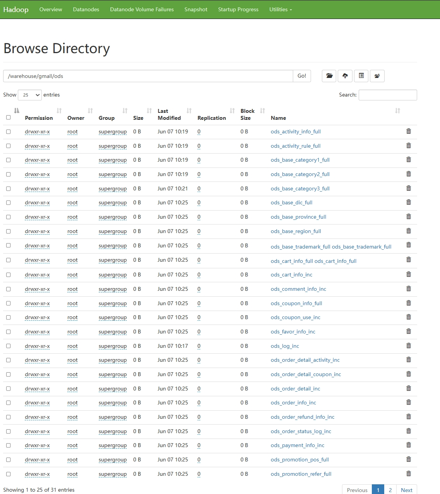

#### 5.1.1 全量表（Full）

| 表名                        | 业务含义   | 数据来源  |
| :------------------------ | :----- | :---- |
| `ods_base_dic_full`       | 编码字典表  | MySQL |
| `ods_activity_rule_full`  | 活动规则表  | MySQL |
| `ods_activity_info_full`  | 活动信息表  | MySQL |
| `ods_base_category1_full` | 一级品类表  | MySQL |
| `ods_base_category2_full` | 二级品类表  | MySQL |
| `ods_base_category3_full` | 三级品类表  | MySQL |
| `ods_base_province_full`  | 省份表    | MySQL |
| `ods_base_region_full`    | 地区表    | MySQL |
| `ods_base_trademark_full` | 品牌表    | MySQL |
| `ods_cart_info_full`      | 购物车全量表 | MySQL |
| `ods_coupon_info_full`    | 优惠券信息表 | MySQL |
| `ods_sku_info_full`       | 商品表    | MySQL |
| `ods_spu_info_full`       | SPU表   | MySQL |

#### 5.1.2 增量表（Inc）

| 表名                     | 业务含义     | 数据来源        |
| :--------------------- | :------- | :---------- |
| `ods_log_inc`          | 用户日志表    | Kafka       |
| `ods_cart_info_inc`    | 购物车增量表   | Kafka (CDC) |
| `ods_comment_info_inc` | 评论增量表    | Kafka (CDC) |
| `ods_coupon_use_inc`   | 优惠券领用增量表 | Kafka (CDC) |
| `ods_favor_info_inc`   | 收藏增量表    | Kafka (CDC) |
| `ods_order_detail_inc` | 订单明细增量表  | Kafka (CDC) |
| `ods_order_info_inc`   | 订单增量表    | Kafka (CDC) |
| `ods_payment_info_inc` | 支付增量表    | Kafka (CDC) |
| `ods_user_info_inc`    | 用户增量表    | Kafka (CDC) |

### 5.2 DIM层（维度数据层）

DIM层存储维度表，为上层分析提供维度支持：

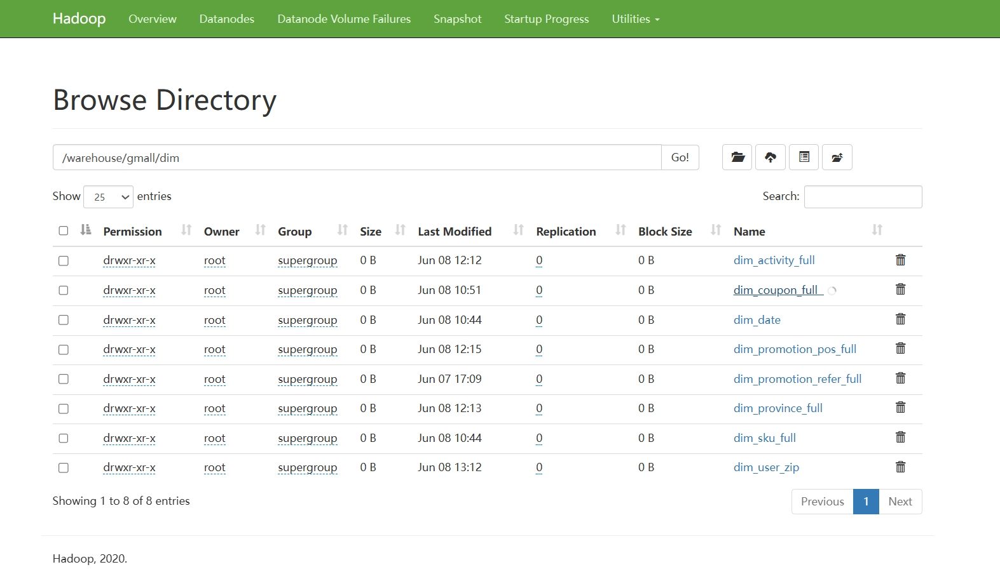

| 维度表                  | 描述        |
| :------------------- | :-------- |
| `dim_base_province`  | 省份维度      |
| `dim_base_region`    | 地区维度      |
| `dim_base_category1` | 一级品类维度    |
| `dim_base_category2` | 二级品类维度    |
| `dim_base_category3` | 三级品类维度    |
| `dim_base_trademark` | 品牌维度      |
| `dim_base_dic`       | 编码字典维度    |
| `dim_sku_info`       | 商品维度      |
| `dim_user_info`      | 用户维度（拉链表） |

*用户维度-拉链表数据装载*
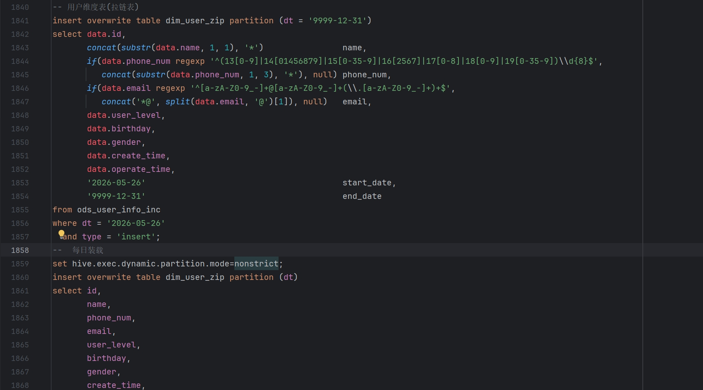

### 5.3 DWD层（数据仓库明细层）

DWD层对ODS层数据进行清洗、转换和整合，构建事务事实表：

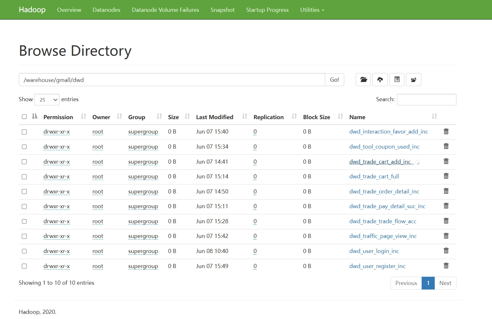

| 事实表                             | 业务域 | 类型   | 描述     |
| :------------------------------ | :-- | :--- | :----- |
| `dwd_trade_cart_add_inc`        | 交易域 | 事务表  | 加购事务   |
| `dwd_trade_order_detail_inc`    | 交易域 | 事务表  | 下单事务   |
| `dwd_trade_pay_detail_suc_inc`  | 交易域 | 事务表  | 支付成功事务 |
| `dwd_trade_cart_full`           | 交易域 | 快照表  | 购物车快照  |
| `dwd_trade_trade_flow_acc`      | 交易域 | 累积快照 | 交易流程   |
| `dwd_tool_coupon_used_inc`      | 工具域 | 事务表  | 优惠券使用  |
| `dwd_interaction_favor_add_inc` | 互动域 | 事务表  | 收藏事务   |
| `dwd_traffic_page_view_inc`     | 流量域 | 事务表  | 页面浏览   |
| `dwd_user_register_inc`         | 用户域 | 事务表  | 用户注册   |
| `dwd_user_login_inc`            | 用户域 | 事务表  | 用户登录   |

*交易域交易流程累积快照事实表数据装载*
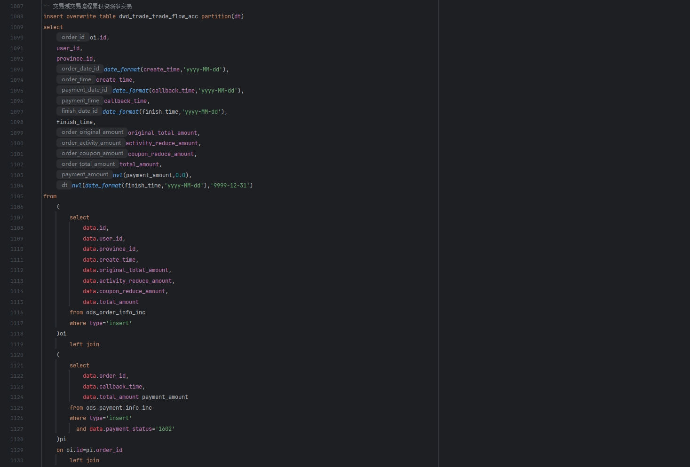

### 5.4 DWS层（数据服务层）

DWS层基于DWD层进行汇总聚合，生成主题宽表：

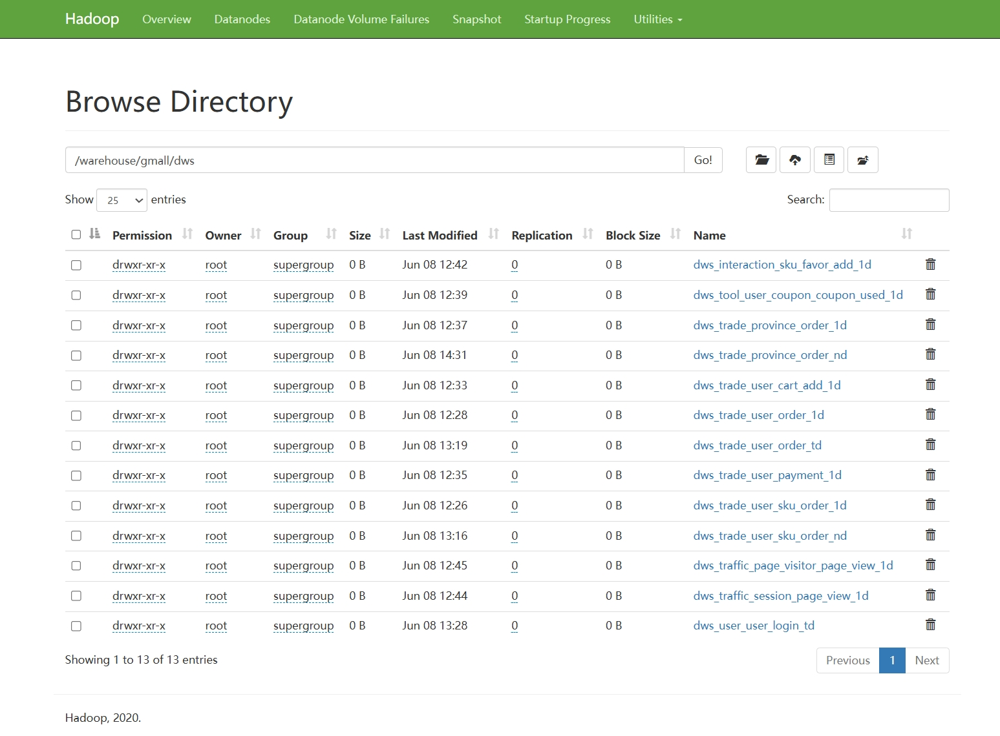

| 宽表                                      | 业务主题        | 聚合粒度     |
| :-------------------------------------- | :---------- | :------- |
| `dws_interaction_sku_favor_add_1d`      | 互动-商品收藏     | 天        |
| `dws_tool_user_coupon_coupon_used_1d`   | 工具-优惠券使用    | 天        |
| `dws_trade_province_order_1d`           | 交易-省份订单     | 省份×天     |
| `dws_trade_province_order_nd`           | 交易-省份累计订单   | 省份×N天    |
| `dws_trade_user_cart_add_1d`            | 交易-用户加购     | 用户×天     |
| `dws_trade_user_order_1d`               | 交易-用户订单     | 用户×天     |
| `dws_trade_user_order_td`               | 交易-用户累计订单   | 用户×截止日   |
| `dws_trade_user_payment_1d`             | 交易-用户支付     | 用户×天     |
| `dws_trade_user_sku_order_1d`           | 交易-用户商品订单   | 用户×商品×天  |
| `dws_trade_user_sku_order_nd`           | 交易-用户商品累计订单 | 用户×商品×N天 |
| `dws_traffic_page_visitor_page_view_1d` | 流量-页面访客浏览   | 页面×访客×天  |
| `dws_traffic_session_page_view_1d`      | 流量-会话页面浏览   | 会话×页面×天  |
| `dws_user_user_login_td`                | 用户-登录累计     | 用户×截止日   |

*交易域用户商品粒度订单最近n日汇总表首日装载*
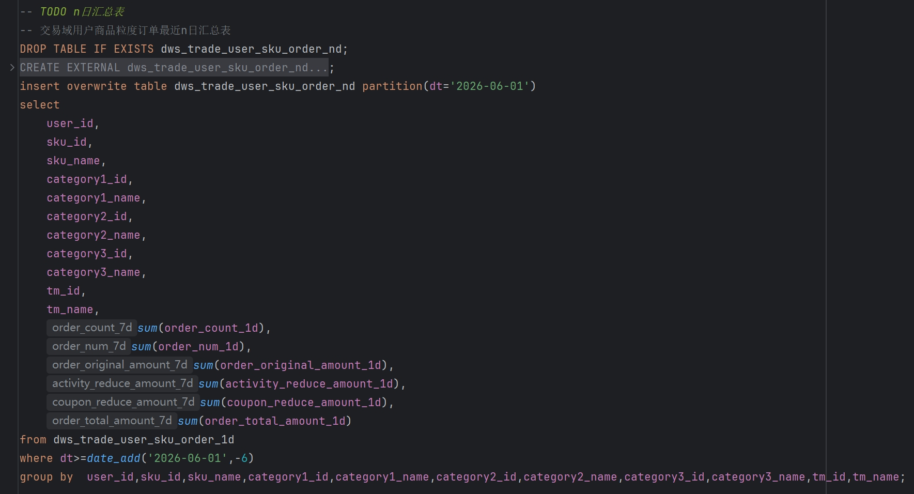

### 5.5 ADS层（应用数据存储）

ADS层生成最终的业务指标，供报表和大屏展示：

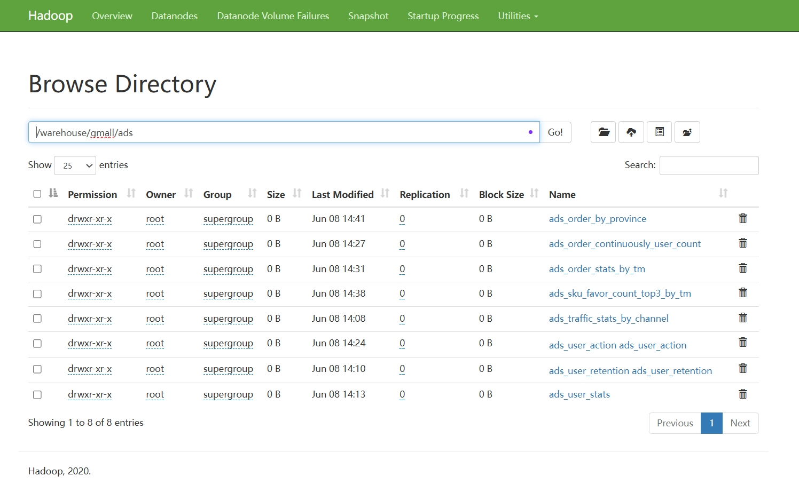

| 指标表                                 | 业务指标       |
| :---------------------------------- | :--------- |
| `ads_order_by_province`             | 订单按省份统计    |
| `ads_order_continuously_user_count` | 连续下单用户数    |
| `ads_order_stats_by_tm`             | 订单按品牌统计    |
| `ads_sku_favor_count_top3_by_tm`    | 品牌商品收藏TOP3 |
| `ads_traffic_stats_by_channel`      | 流量按渠道统计    |
| `ads_user_action`                   | 用户行为统计     |
| `ads_user_retention`                | 用户留存统计     |
| `ads_user_stats`                    | 用户统计       |

*各品牌商品下单统计数据装载*
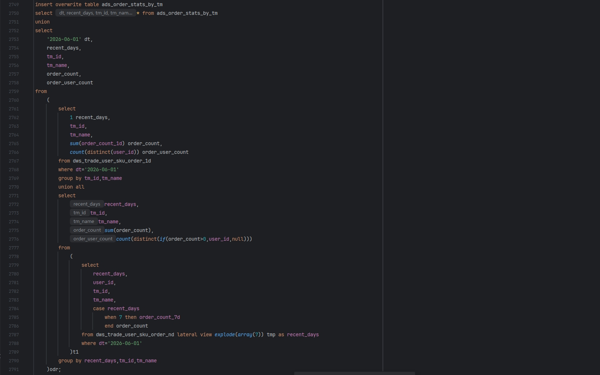

## 6 核心表结构说明

### 6.1 ODS层核心表

#### 日志表结构 (`ods_log_inc`)

| 字段         | 类型            | 描述               |
| :--------- | :------------ | :--------------- |
| `common`   | STRUCT        | 公共信息（渠道、设备、用户等）  |
| `page`     | STRUCT        | 页面信息（页面ID、停留时间等） |
| `actions`  | ARRAY<STRUCT> | 动作信息             |
| `displays` | ARRAY<STRUCT> | 曝光信息             |
| `start`    | STRUCT        | 启动信息             |
| `err`      | STRUCT        | 错误信息             |
| `ts`       | BIGINT        | 时间戳              |

#### 订单增量表结构 (`ods_order_info_inc`)

| 字段     | 类型     | 描述                         |
| :----- | :----- | :------------------------- |
| `type` | STRING | 变动类型（insert/update/delete） |
| `ts`   | BIGINT | 变动时间戳                      |
| `data` | STRUCT | 数据内容                       |
| `old`  | MAP    | 旧值（更新前数据）                  |

### 6.2 DWD层核心表

#### 交易域下单事务事实表 (`dwd_trade_order_detail_inc`)

| 字段                      | 类型            | 描述       |
| :---------------------- | :------------ | :------- |
| `id`                    | STRING        | 订单明细ID   |
| `order_id`              | STRING        | 订单ID     |
| `user_id`               | STRING        | 用户ID     |
| `sku_id`                | STRING        | 商品SKU ID |
| `province_id`           | STRING        | 省份ID     |
| `activity_id`           | STRING        | 活动ID     |
| `coupon_id`             | STRING        | 优惠券ID    |
| `date_id`               | STRING        | 日期ID     |
| `sku_num`               | BIGINT        | 商品数量     |
| `split_original_amount` | DECIMAL(16,2) | 原始金额     |
| `split_activity_amount` | DECIMAL(16,2) | 活动优惠     |
| `split_coupon_amount`   | DECIMAL(16,2) | 优惠券优惠    |
| `split_total_amount`    | DECIMAL(16,2) | 最终金额     |

## 7 任务调度

### 7.1 DolphinScheduler工作流规划

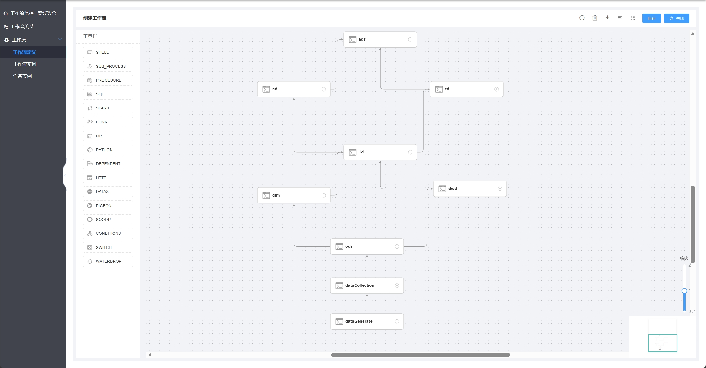

### 7.2 调度架构

使用Apache DolphinScheduler进行任务编排：

```
每日定时任务流（3小时压缩）：
┌────────────────────────────────────────────────────────────┐
│  00:00  dataGenerate 模拟数据生成                          │
│         ↓                                                  │
│  00:30  dataCollection 数据采集 (DataX/Flume)              │
│         ↓                                                  │
│  01:00  ODS层数据落地                                      │
│         ↓                                                  │
│  01:30  DWD层明细加工 + DIM层维度加载                       │
│         ↓                                                  │
│  02:00  DWS层汇总处理（1D/ND/TD）                           │
│         ↓                                                  │
│  02:30  ADS层指标计算与数据质量校验                         │
└────────────────────────────────────────────────────────────┘
```

### 7.3 调度依赖关系

| 任务                 | 依赖任务               | 执行时间  |
| :----------------- | :----------------- | :---- |
| dataGenerate       | -                  | 00:00 |
| dataCollection     | dataGenerate       | 00:30 |
| ODS层数据落地           | dataCollection     | 01:00 |
| DWD层明细加工           | ODS层数据落地           | 01:30 |
| DIM层维度加载           | ODS层数据落地           | 01:30 |
| DWS层汇总处理（1D/ND/TD） | DWD层明细加工、DIM层维度加载  | 02:00 |
| ADS层指标计算           | DWS层汇总处理（1D/ND/TD） | 02:30 |

## 8 数据可视化

### 8.1 可视化工具

- **Apache Superset**: 用于制作常规报表和仪表盘

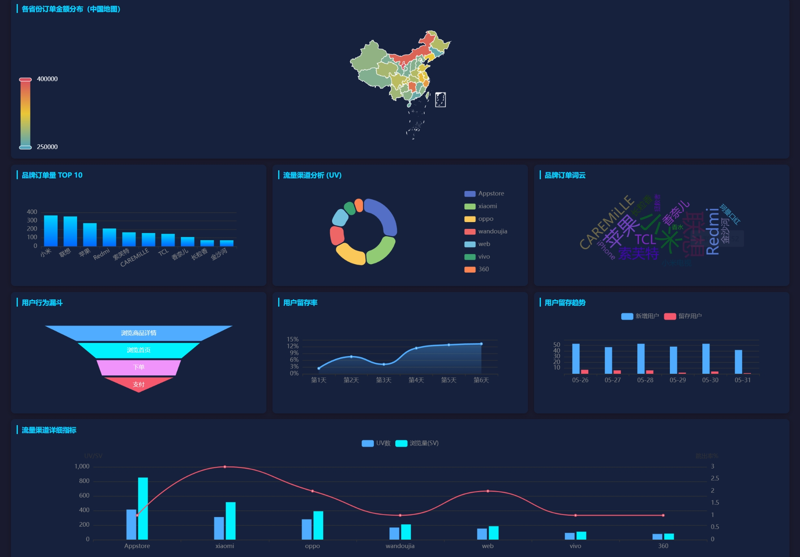

### 8.2 核心指标看板

| 看板类型     | 核心指标             |
| :------- | :--------------- |
| **交易大屏** | 订单量、支付金额、转化率     |
| **用户大屏** | 新增用户、活跃用户、留存率    |
| **流量大屏** | PV、UV、页面访问TOP10  |
| **商品大屏** | 热销商品、商品点击率、商品转化率 |

## 9 代码目录结构

```
├── scripts/                         # 脚本目录
│   ├── README.md                    # 脚本目录说明
│   ├── create_tables_initial.sql    # ODS/DWD建表及首日数据插入
│   ├── datax_full_DS/               # DataX全量同步（MySQL→HDFS）
│   │   ├── gen_import_config.py
│   │   ├── gen_import_config.sh
│   │   └── ...
│   ├── flume/                       # Flume数据采集配置
│   │   ├── topic_db同步/            # 业务数据同步（Kafka→HDFS）
│   │   ├── topic_log同步/           # 日志数据同步（Kafka→HDFS）
│   │   └── ...
│   ├── hive/                        # Hive每日数据装载脚本
│   │   ├── hdfs_to_ods.sh           # HDFS→ODS
│   │   ├── ods_to_dim.sh            # ODS→DIM
│   │   └── ...
│   ├── maxwell_inc_DS/              # Maxwell增量采集binlog
│   │   └── mxw.sh
│   └── mock/                        # 模拟数据生成
│       └── mock.sh
├── images/                          # 项目图片资源
│   ├── business_data.jpg
│   └── ...
└── README.md                        # 项目说明文档
```

## 10 数据质量保障

### 10.1 数据校验规则

| 校验类型  | 校验规则           | 处理方式    |
| :---- | :------------- | :------ |
| 完整性校验 | 主键非空、必填字段非空    | 告警并标记异常 |
| 准确性校验 | 金额计算正确性、枚举值合法性 | 告警并修正   |
| 一致性校验 | 父子表关联一致性       | 告警并修复   |
| 时效性校验 | 数据延迟检测         | 告警并监控   |

### 10.2 监控告警

- **监控指标**: 数据延迟、数据量波动、任务成功率
- **告警方式**: 邮件、短信
- **告警阈值**: 延迟超过30分钟、retry超过5次

***

*文档版本: v1.2*\
*创建日期: 2026-06-02*\
*最后更新: 2026-06-09*
